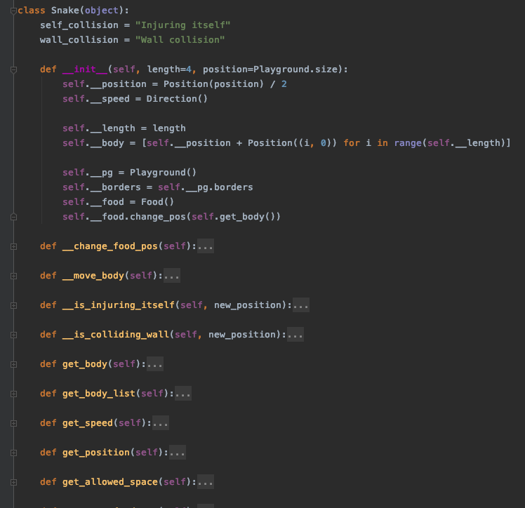

# Smake (Smart Snake or Snake-AI)

The main idea of this project is to prove that complicated Machine Learning methods 
and tools not always allow to reach a desired goal. 

The first part of this project is to build an application, which outputs a controllable 
snake game model (in different words a well-known snake game).

The second part is to connect an artificial player which will be simulated by
a simple NN or a simple mathematical model.

And the first part of the project was finished in terms of the small university project, 
the main idea of the pet project is to make acquaintance with some topics of Software engineering.

[//]:#

----

Travis-CI:

AppVeyor:

CodeCov:

CodeClimate:

Sonarcloud:

## 1. UML
To create UML diagrams I used a PlantUML plugin in PyCharm.
### 1.1. Class Diagram

  

### 1.2. Use Case diagram

  

### 1.3. Activity diagram

  

## 2. Metrics

Besides the badges at the beginning of the page,
you can find additional information about used metrics
on the following pages:
* [sonarcloud.io](https://sonarcloud.io/dashboard?id=ElijahOzhmegov_Smake-Snake-AI-) 
page 
* [codeclimate](https://codeclimate.com/github/ElijahOzhmegov/Smake-Snake-AI-) page
* [codecov.io](https://codecov.io/gh/ElijahOzhmegov/Smake-Snake-AI-) page

## 3. Clean Code Development
To prove that in this project was used **Clean Code Development** 
principles I will show the results of code analysis services.

1. DRY Principle implementation

    This badge () 
    indicates the percent of duplicated lines.
    Also if you check out [codeclimate page](https://codeclimate.com/github/ElijahOzhmegov/Smake-Snake-AI-) 
    of the project, you also will see the number of duplicated lines.

1. SLA Principle implementation

    This principle can be shown via the following badges (, 
    ), 
    because mentioned services evaluate code complexity.
    
1. Law of Demeter implementation

    Applying the Law of Demeter would only allow access to public 
    methods 
    of the class **Snake**.
    

### CI/CD
Travis-CI service after the unit tests sends 
a report to CodeClimate.com about test coverage.
Details can be found in **travis.yml** file.
